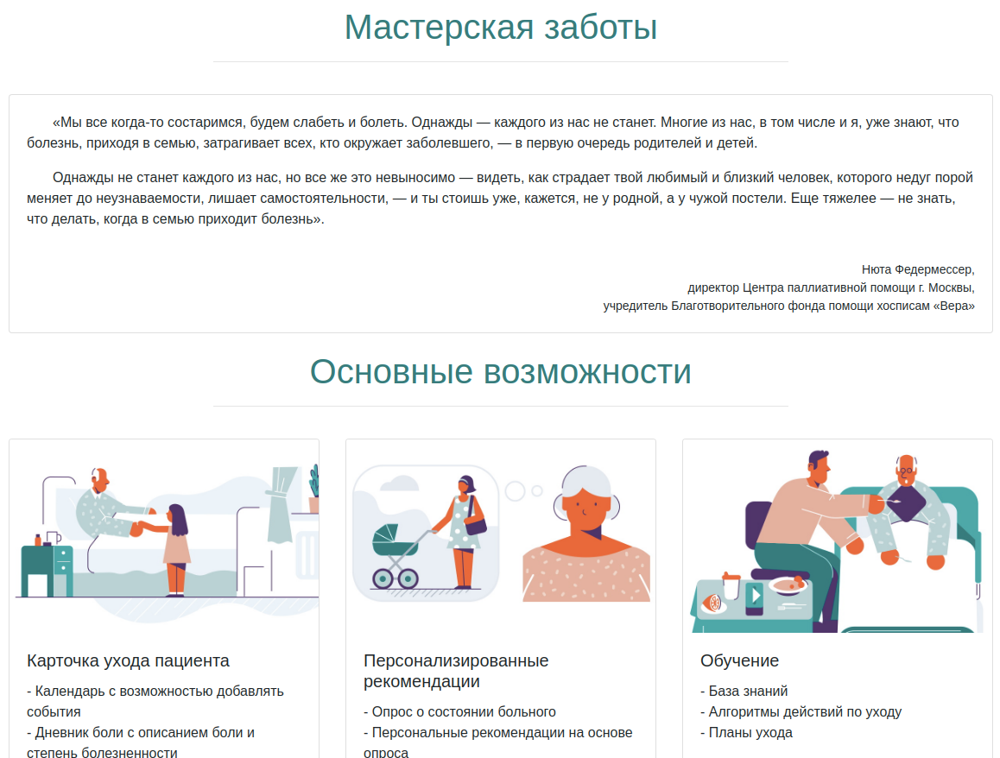
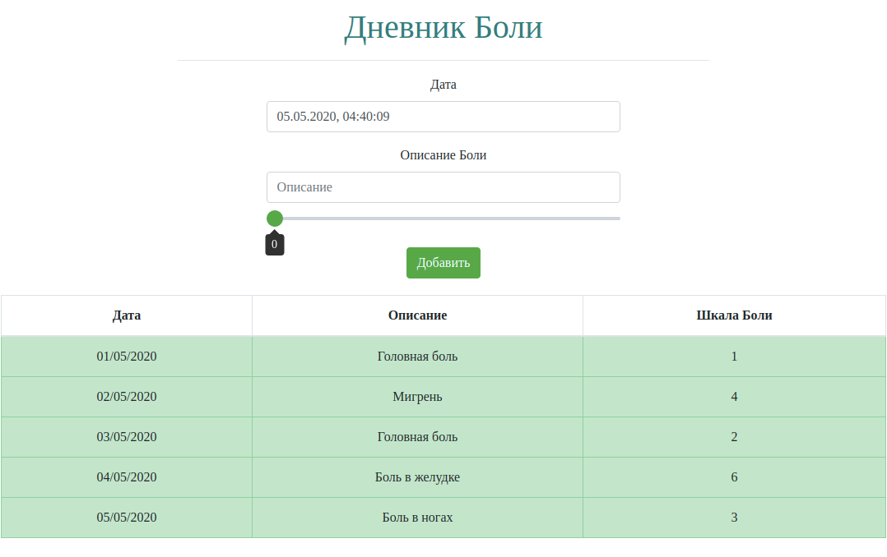

# Уход за тяжелобольными в цифровом городе

## ИДЕЯ И ЦЕЛЕВАЯ АУДИТОРИЯ

Предоставить персонализированный сервис для помощи в организации ухода за тяжелобольными людьми.
Целевая аудитория приложения - близкие родственники или сиделки
***
## СУТЬ РЕШЕНИЯ

Решение состоит в том, чтобы объединить в одном приложении весь комплекс необходимого информативного и вспомогательного функционала для помощи в уходе за тяжелобольным человеком.
